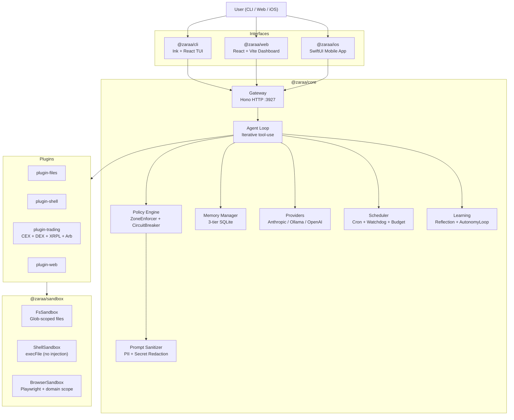
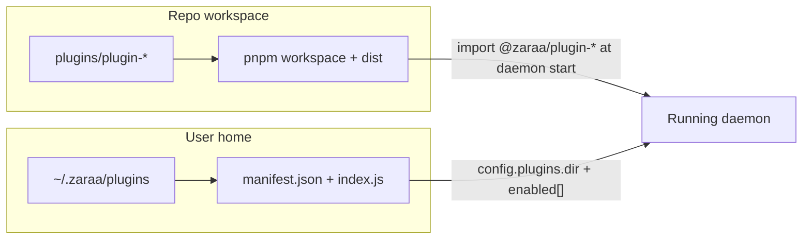

# Zaraa — Personal AI Agent Platform

> Privacy-first, locally-controllable AI agent with tiered trust zones, crypto trading engine, and a full-stack interface across terminal, web, and iOS.

Zaraa is an open-source personal AI agent platform. Every action — reading files, running shell commands, placing trades, browsing the web — is governed by a policy engine that enforces trust boundaries, rate limits, and audit logging. Your data stays local unless you explicitly allow it to leave.

---

## Table of Contents

- [What Zaraa Does](#what-zaraa-does)
- [Architecture](#architecture)
- [Tech Stack](#tech-stack)
- [Prerequisites](#prerequisites)
- [Quick Start](#quick-start)
- [Configuration Reference](#configuration-reference)
- [CLI Commands](#cli-commands)
- [HTTP Gateway API](#http-gateway-api)
- [Plugin System](#plugin-system)
- [Trading Plugin](#trading-plugin)
- [Web Dashboard](#web-dashboard)
- [iOS App](#ios-app)
- [Development Guide](#development-guide)
- [Troubleshooting](#troubleshooting)
- [Contributing](#contributing)
- [Operator playbook](docs/operator-playbook.md) — zones, approvals, trading safety, prompts
- [Runbooks index](docs/runbooks/README.md) — backup, restore, upgrade, rollback, recovery
- [Incident response](docs/security/incident-response.md) — key rotation, session revoke, comms template
- [Zaraacoder daily-use runbook](docs/runbooks/zaraacoder-daily-use.md) — local UI project-development loop
- [Ship readiness roadmap](docs/ship-readiness-roadmap.md) — tomorrow vs 100% plan

---

## What Zaraa Does

Zaraa is a general-purpose AI agent that runs on your machine. You talk to it in natural language, and it takes actions on your behalf — always within the safety boundaries you configure.

**Core capabilities:**

- **Agentic chat** — Iterative tool-use loop: Zaraa plans, calls tools, observes results, and keeps going until the task is done. You can watch every step in real time.
- **File & shell access** — Read/write files and run commands within your configured allowlists. Shell injection is prevented by design.
- **3-tier memory** — Episodic (recent, decaying), semantic (stable facts), and procedural (trigger-based workflows) memory, all stored locally in SQLite.
- **Multi-provider LLMs** — Route different tasks to different models: Anthropic Claude for complex reasoning, local Ollama for sandbox/private tasks, OpenAI/Gemini as fallbacks.
- **Scheduled tasks** — Cron-based background tasks (morning briefings, market scans, calendar summaries) with daily token/cost budget limits.
- **Crypto trading** — Full trading engine with CEX, XRPL DEX, Stellar DEX, Solana DEX, and Flare DEX support. Paper trading by default, real trading requires explicit opt-in.
- **Integrations** — Google Calendar, Telegram, Slack, Discord, Notion, GitHub, Spotify, Gmail, and more.
- **Voice** — OpenAI Realtime voice I/O over WebSocket.
- **Privacy** — PII redaction, API key scrubbing, confidential path blocking, and prompt sanitization — all before data leaves your machine.

---

## Architecture



### How it works

1. You send a message via CLI, web, iOS, or HTTP API.
2. The **Gateway** (Hono, port 3927) authenticates and routes to the **Agent Loop**.
3. The Agent Loop calls an LLM (routed by zone and task type via **ModelRouter**).
4. The LLM returns tool calls. Each tool call becomes an **Action**.
5. The **Policy Engine** evaluates every action: zone check → circuit breaker → confidence score → audit log.
6. Approved actions execute in the appropriate **Sandbox** (filesystem, shell, browser).
7. Results feed back to the LLM, which continues until the task is complete.
8. The full event stream (plan, tool-call, result, response) is streamed to your interface in real time.

### Trust Zones

| Zone | Files | Shell | Network | Approval |
|------|-------|-------|---------|----------|
| **Sandbox** | Read-only (scoped) | None | None | Not needed |
| **Guarded** | Glob-scoped r/w | Allowlisted `execFile` | Allowlisted domains | Required for writes |
| **Trusted** | Full access | Full access | Full access | Audit-only |

**Sandbox** is the default. Safe for exploration and Q&A — no side effects.

**Guarded** enables real work within configured boundaries. You define which directories, commands, and domains are allowed. Writes and risky commands queue for your approval.

**Trusted** is full access with a full audit trail. Auto-downgrades to sandbox after a configurable timeout or on anomaly detection.

For day-to-day habits (approvals, trading safety, prompts, gateway hygiene), see **[Operator playbook](docs/operator-playbook.md)**.

### Circuit Breaker

The circuit breaker trips when:
- File writes exceed 50/minute
- Shell commands exceed 20/minute
- Network requests exceed 30/minute
- A sensitive path is accessed (`~/.ssh/**`, `~/.aws/**`)

When tripped, the system auto-demotes to sandbox and blocks all further actions until manually reset.

---

## Tech Stack

| Layer | Technology |
|-------|-----------|
| Language | TypeScript (strict, ES modules) |
| Runtime | Node.js 22+ |
| Package manager | pnpm 9 |
| Build system | Turborepo + tsup |
| Linter/formatter | Biome |
| Testing | Vitest |
| HTTP server | Hono 4 |
| Terminal UI | Ink 6 + React 19 |
| Web UI | React 19 + Vite 7 + Zustand + Tailwind |
| Mobile | SwiftUI (iOS 17+) |
| Database | SQLite via better-sqlite3 |
| Vector search | sqlite-vec |
| Browser automation | Playwright |
| LLM providers | Anthropic, Ollama, OpenAI, Gemini, OpenRouter |
| Crypto trading | Crypto.com CEX, XRPL DEX, Stellar DEX, Solana DEX (Raydium/Orca/Jupiter), Flare DEX |
| CI | GitHub Actions |

---

## Prerequisites

Before you start, you need:

1. **Node.js 22 or later**
   ```bash
   node --version   # must be >= 22.0.0
   ```
   Install from [nodejs.org](https://nodejs.org) or use `nvm install 22`.

2. **pnpm 9 or later**
   ```bash
   npm install -g pnpm@9
   pnpm --version   # must be >= 9.0.0
   ```

3. **An LLM provider** (at least one):
   - **Anthropic Claude** (recommended) — get an API key at console.anthropic.com
   - **Ollama** (free, local) — install from [ollama.ai](https://ollama.ai), then `ollama pull llama3`
   - **OpenAI** — get an API key at platform.openai.com

4. **Optional — for the trading plugin:**
   - Exchange API credentials (Crypto.com, etc.) stored in `~/.zaraa/zaraa.config.json`
   - XRPL wallet address for DEX monitoring

5. **Optional — for the iOS app:**
   - Xcode 15+
   - iPhone 16 Pro simulator or physical device

---

## Quick Start

### 1. Clone and install

```bash
git clone <repo-url> zara
cd zara
pnpm install
```

### 2. Build

```bash
pnpm -r run build
npx tsc --noEmit
pnpm -r run test
```

The recursive build follows workspace dependencies, including `shared` before `core`.

### 3. Configure Zaraa

Edit `~/.zaraa/zaraa.config.json`:

```json
{
  "providers": [
    {
      "name": "anthropic",
      "type": "anthropic",
      "apiKey": "sk-ant-...",
      "models": ["claude-sonnet-5"]
    }
  ],
  "models": {
    "default": "claude-sonnet-5"
  }
}
```

For local-only (no cloud, free):
```json
{
  "providers": [
    {
      "name": "ollama",
      "type": "ollama",
      "baseUrl": "http://localhost:11434",
      "models": ["llama3"]
    }
  ],
  "models": {
    "default": "ollama/llama3"
  }
}
```

Set `gateway.auth.apiKey` there for gateway authentication. Clients send it as
`X-Api-Key`; the gateway API key does not live in `.env`.

### 4. Start daemon and web dashboard

```bash
# Terminal 1: start the daemon (gateway on :3927)
node scripts/zaraa-daemon.mjs

# Terminal 2: start Vite dev/HMR (web on :3929)
npx vite --port 3929
```

Port 3928 is reserved for the built `packages/web/dist` served by the daemon.

---

## Configuration Reference

Config lives at `~/.zaraa/zaraa.config.json`; edit it directly. All fields are optional — missing ones fall back to safe defaults.

### Full example

```json
{
  "defaultZone": "sandbox",

  "zones": {
    "guarded": {
      "files": {
        "allow": ["~/Documents/**", "~/Projects/**"],
        "deny":  ["~/Documents/secrets/**"]
      },
      "network": {
        "allow": ["api.anthropic.com", "api.openai.com", "localhost:11434"]
      },
      "shell": {
        "allow":   ["ls", "cat *", "git *", "echo *"],
        "approve": ["rm *", "mv *", "cp *"],
        "deny":    ["sudo *"]
      }
    },
    "trusted": {
      "enabled": false,
      "requireAuth": true,
      "autoDowngrade": {
        "afterMinutes": 60,
        "onAnomaly": true
      }
    }
  },

  "providers": [
    {
      "name": "anthropic",
      "type": "anthropic",
      "apiKey": "sk-ant-...",
      "models": ["claude-sonnet-5", "claude-opus-4-8"]
    },
    {
      "name": "ollama",
      "type": "ollama",
      "baseUrl": "http://localhost:11434",
      "models": ["llama3.2:3b"]
    }
  ],

  "models": {
    "default":    "claude-sonnet-5",
    "sandbox":    "llama3.2:3b",
    "guarded":    "claude-sonnet-5",
    "background": "llama3.2:3b",
    "coding":     "claude-sonnet-5",
    "deep":       "claude-opus-4-8"
  },

  "privacy": {
    "confidential":        ["~/.ssh/**", "~/.aws/**", "**/.env", "**/*secret*"],
    "neverSendPatterns":   ["sk-", "ghp_", "AKIA"],
    "onConfidentialAccess": "ask",
    "promptInspection":    "log",
    "networkMode":         "selective"
  },

  "scheduler": {
    "tasks": [
      {
        "id":       "morning-briefing",
        "schedule": "0 9 * * *",
        "zone":     "guarded",
        "prompt":   "Give me a morning briefing: calendar, market overview, and top tasks",
        "notify":   "os"
      }
    ],
    "watchdogs": [],
    "limits": {
      "maxTokensPerDay":    1000000,
      "maxTasksPerHour":    60,
      "maxCostPerDay":      "$10",
      "pauseOnBudgetExhaust": true
    }
  },

  "performance": "auto",
  "personality": "adaptive",

  "voice": {
    "provider": "openai-realtime",
    "stt": { "engine": "whisper" },
    "tts": { "engine": "openai-tts" }
  },

  "calendar": {
    "enabled": true,
    "google": {
      "clientId":     "...",
      "clientSecret": "..."
    }
  },

  "messaging": {
    "telegram": {
      "botToken":      "...",
      "enableGateway": true
    },
    "slack": {
      "botToken":       "...",
      "appToken":       "...",
      "signingSecret":  "..."
    }
  },

  "integrations": {
    "notion": { "apiKey": "..." },
    "github": { "token": "..." },
    "spotify": {
      "clientId":     "...",
      "clientSecret": "...",
      "accessToken":  "...",
      "refreshToken": "..."
    }
  },

  "gateway": {
    "auth": { "apiKey": "your-gateway-api-key" }
  },

  "plugins": {
    "dir":     "~/.zaraa/plugins",
    "enabled": ["plugin-files", "plugin-shell", "plugin-trading"]
  }
}
```

### Key fields

| Field | Type | Default | Description |
|-------|------|---------|-------------|
| `defaultZone` | `"sandbox"` \| `"guarded"` \| `"trusted"` | `"sandbox"` | Starting trust zone |
| `zones.guarded.files.allow` | `string[]` | `[]` | Glob patterns for allowed file paths in guarded mode |
| `zones.guarded.files.deny` | `string[]` | `[]` | Glob patterns always blocked (takes precedence over allow) |
| `zones.guarded.network.allow` | `string[]` | `[]` | Domains Zaraa can reach in guarded mode |
| `zones.guarded.shell.allow` | `string[]` | `[]` | Commands auto-approved in guarded mode |
| `zones.guarded.shell.approve` | `string[]` | `[]` | Commands that require your confirmation |
| `zones.guarded.shell.deny` | `string[]` | `[]` | Commands always blocked |
| `zones.trusted.enabled` | `boolean` | `false` | Whether trusted mode can be activated |
| `zones.trusted.autoDowngrade.afterMinutes` | `number` | `60` | Auto-return to sandbox after this many minutes |
| `providers` | `ProviderConfig[]` | `[]` | LLM provider definitions |
| `models.default` | `string` | `"claude-sonnet-5"` | Model used when no zone-specific model is set |
| `models.sandbox` / `guarded` / `trusted` / `chat` / `background` / `coding` / `deep` / `deeper` / `opus` / `agent` / `superdebug` / `fast` / `toolcaller` / `codereview` / `introspection` | `string` | — | Override model per zone / use case (any subset; falls back to `models.default`) |
| `privacy.onConfidentialAccess` | `"block"` \| `"summarize-locally"` \| `"ask"` | `"block"` | What to do when a confidential path is accessed |
| `privacy.promptInspection` | `"off"` \| `"log"` \| `"approve"` | `"off"` | Prompt inspection mode |
| `privacy.networkMode` | `"open"` \| `"selective"` \| `"local-only"` | `"selective"` | Network access policy |
| `scheduler.limits.maxTokensPerDay` | `number` | `100000` | Daily token budget (`0` = unlimited) |
| `scheduler.limits.maxCostPerDay` | `string` | `"5.00"` | Daily cost cap (a leading `$` is accepted, e.g. `"$5.00"`) |
| `scheduler.limits.pauseOnBudgetExhaust` | `boolean` | `true` | Auto-pause when budget is exhausted |
| `performance` | `"minimal"` \| `"balanced"` \| `"performance"` \| `"unleashed"` \| `"auto"` | `"auto"` | Model selection strategy |
| `personality` | `"adaptive"` \| `"warm"` \| `"minimal"` \| `"casual"` | `"adaptive"` | Response tone |
| `gateway.auth.apiKey` | `string` | — | API key for HTTP gateway (optional) |

### Environment variables

Optional runtime overrides may be loaded from `$CWD/.env` or `~/.zaraa/.env`.
Gateway authentication remains `gateway.auth.apiKey` in `~/.zaraa/zaraa.config.json`:

| Variable | Description |
|----------|-------------|
| `ZARA_CONFIG_PATH` | Override config file location |
| `ANTHROPIC_API_KEY` | Claude API key (alternative to putting it in config) |
| `OPENAI_API_KEY` | OpenAI API key |
| `OLLAMA_BASE_URL` | Ollama endpoint (default: `http://localhost:11434`) |
| `LOG_LEVEL` | Logging verbosity (`debug`, `info`, `warn`, `error`) |

---

## CLI Commands

### Interactive chat

```bash
zaraa
```

Opens the terminal UI. Type messages, press Enter. Press Ctrl+C to exit.

### One-shot message

```bash
zaraa "Summarize my Documents/notes.txt"
```

Sends a single message, prints the response, and exits.

### Setup wizard

```bash
node packages/cli/dist/zaraa.js setup
```

Runs the interactive setup wizard. Creates `~/.zaraa/zaraa.config.json` if it doesn't exist.

### System diagnostics

```bash
node packages/cli/dist/zaraa.js doctor
```

Checks:
- Config file validity
- Provider connectivity (pings each configured provider)
- SQLite database integrity
- Memory system status
- Scheduler health

### Audit trail

```bash
zaraa audit
```

Displays recent entries from the audit log at `~/.zaraa/data/audit/audit.jsonl`. Shows timestamp, zone, action type, target, and result.

Filled **`trade_buy`** / **`trade_sell`** responses include **`orderAuditCorrelationId`** (`zord_…`); the same value appears as **`correlationId`** on **`trading.order`** lines in that file. See [docs/runbooks/trading-order-audit.md](docs/runbooks/trading-order-audit.md).

### Memory management

```bash
zaraa memory search "bitcoin"       # search memories matching "bitcoin"
zaraa memory forget "old trade"     # delete memories matching "old trade"
```

### Research intake (quick capture)

Two lightweight tools are available to feed Zaraa learning inputs:

```bash
# Capture a text snip for ingestion (useful for notes, meeting takes, quick ideas)
pnpm zaraa:snip --title "Why this worked" "Captured takeaway text."

# Drop files for learning (PDFs, notes, transcripts, etc.)
pnpm zaraa:file-drop notes/strategy-review.md --tags strategy,research
```

Both tools write artifacts under `~/.zaraa/inbox/` and store a searchable document in
`~/.zaraa/data/documents.db`. Run `node scripts/zaraa-ingest-to-memory.ts` after
dropping major research so semantic memories are extracted automatically.

### Self-improvement patching

Use the native operator-style patch queue when you want to steer Zaraa's own improvement work:

```bash
zaraa self-improve disciplines
zaraa self-improve preview starter --full
zaraa self-improve send starter
zaraa self-improve preview wave 2 --discipline security-privacy
zaraa self-improve send task sip-0151
```

The native CLI command wraps the repo's self-improvement patch submitter, defaults to operator voice, and will generate the manifest automatically if it is missing. For the full operator workflow, see [docs/runbooks/zaraa-self-improvement-operator-guide.md](docs/runbooks/zaraa-self-improvement-operator-guide.md).

### Overnight operator pack

Use the overnight operator pack when you want Zaraa to keep working while you sleep:

```bash
zaraa overnight list
zaraa overnight preview
zaraa overnight send
zaraa overnight preview task ovn-008 --full
```

The overnight flow wraps the repo's overnight submitter, defaults to operator voice, and will generate the overnight manifest automatically if it is missing. For the full workflow, see [docs/runbooks/zaraa-overnight-operator-guide.md](docs/runbooks/zaraa-overnight-operator-guide.md).

### Watching Zaraacoder

Use the terminal watcher when dogfooding Zaraacoder and checking runtime posture:

```bash
pnpm zaraacoder:watch -- --once
pnpm zaraacoder:watch -- --json --once
pnpm zaraacoder:watch -- review
pnpm zaraacoder:watch -- verify
pnpm zaraacoder:watch -- promote --confirm promote
```

The watcher is an operator console. It reads dogfood artifacts, checks the gateway when reachable, and delegates review/promote work to the guarded Zaraacoder review script. Promotion still requires the existing review-ready checks plus typed confirmation.

### Config file path

```bash
zaraa config file
```

Prints the resolved path to the active config file (useful when using `ZARA_CONFIG_PATH`).

### Global options

```bash
-z, --zone <zone>   Override zone for this session (sandbox | guarded | trusted)
-p, --port <port>   Gateway port (default: 3927)
    --discipline <slug>   Filter self-improvement tasks by discipline
    --match <text>        Filter self-improvement tasks by text
    --task <id>           Select one self-improvement task by id
    --limit <n>           Limit self-improvement task count after filtering
    --voice         Self-improvement prompt voice (`operator` or `structured`)
    --full          Full preview for self-improvement tasks
    --delay-ms      Delay between dispatched self-improvement tasks
-h, --help          Show help
-v, --version       Show version
```

**Examples:**

```bash
zaraa -z guarded "List files in ~/Documents"
zaraa -z trusted -p 4000 "Run system diagnostics"
```

---

## HTTP Gateway API

The gateway runs on `http://localhost:3927` (configurable with `-p`). It provides a REST + WebSocket interface for programmatic access and powers the web dashboard.

**Authentication:** Add `X-Api-Key: your-key` header if you've set `gateway.auth.apiKey` in config.

**Error responses:** JSON error bodies include `error` (human message) and `code` (stable machine-readable string, `ZARA_*`). See [`docs/gateway-error-codes.md`](docs/gateway-error-codes.md).

### Health

```http
GET /health
→ { "status": "ok" }
```

### Chat (streaming)

```http
POST /api/chat
Content-Type: application/json
X-Api-Key: your-key

{ "message": "What is the BTC price?", "sessionId": "optional-uuid" }
```

Response is **NDJSON** — one JSON object per line:

```json
{ "type": "plan", "content": "I'll check the current BTC price..." }
{ "type": "tool-call", "toolCall": { "name": "trade_get_price", ... }, "action": {...} }
{ "type": "tool-result", "toolCallId": "...", "result": { "approved": true, "output": {...} } }
{ "type": "response", "content": "BTC is currently $67,420." }
```

Event types: `plan`, `tool-call`, `tool-result`, `response`, `error`, `approval-needed`, `reflect`, `text-delta`, `memory-used`.

### Zone management

```http
POST /api/zone
Content-Type: application/json

{ "zone": "guarded" }
→ { "zone": "guarded" }
```

### Memory

```http
GET /api/memory?q=bitcoin&limit=10
→ [{ "id": "...", "content": "...", "tier": "episodic", "relevance": 0.95 }]

POST /api/memory/forget
{ "query": "old data", "limit": 5 }
→ { "deleted": 5 }
```

### Audit log

```http
GET /api/journal?limit=100&actionType=file.write
→ { "entries": [{ "id": "...", "taskId": "...", "actionType": "file.write", "target": "...", "status": "executed", "timestamp": "..." }] }
```

### Approval queue

```http
GET /api/approvals
→ { "approvals": [ { "id": "...", ... } ] }

POST /api/approvals/:id/approve
→ { "status": "approved" }

POST /api/approvals/:id/deny
→ { "status": "denied" }
```

### Tasks

```http
POST /api/tasks
{ "prompt": "Check all positions", "zone": "guarded", "priority": "high" }
→ { "id": "uuid", "status": "pending" }

GET /api/tasks/:taskId
→ { "id": "...", "status": "executing", "progress": "..." }
```

### WebSocket

```javascript
const ws = new WebSocket("ws://localhost:3927/ws");
ws.send(JSON.stringify({ type: "message", content: "Morning briefing please" }));
ws.onmessage = (e) => console.log(JSON.parse(e.data)); // AgentEvent stream
```

---

## Plugin System

Zaraa's capabilities are extensible through plugins. Each plugin declares a **manifest** that specifies its name, version, minimum required zone, and the tools it provides.

### Built-in plugins

| Plugin | Min Zone | Tools |
|--------|----------|-------|
| `plugin-files` | sandbox (read), guarded (write) | `file_read`, `file_write`, `file_list` |
| `plugin-shell` | guarded | `shell_exec` |
| `plugin-trading` | guarded | 120+ trading tools |
| `plugin-web` | guarded | Web scraping + browsing |

### Repo plugins vs `~/.zaraa/plugins`

These are two different load paths. Do not copy workspace plugins into the user plugin dir.



| Tree | What lives there | How it loads | How you update it |
|------|------------------|--------------|-------------------|
| `plugins/` in this repo | First-party workspace packages (`plugin-trading`, `plugin-web`, …) | Built with `pnpm --filter <pkg> build`, imported by core at start | Edit source, rebuild that package, governed daemon restart |
| `~/.zaraa/plugins` | Dynamic / forged / third-party drops | `loadDynamicPlugins()` scans `config.plugins.dir` for `manifest.json` (and optional `index.js` `createHandlers`) | Drop a folder, add the manifest `name` to `plugins.enabled` if that list is set, restart |

`plugins.enabled` only filters the **user** dir. Workspace plugins are not enabled by copying them to `~/.zaraa/plugins`. Plugin Forge writes new manifests under `~/.zaraa/plugins`, not into the git tree.

### Writing a custom plugin

1. Create a directory in `plugins/my-plugin/`
2. Define your manifest in `src/index.ts`:

```typescript
import type { PluginManifest } from "@zaraa/shared";

export const manifest: PluginManifest = {
  name: "my-plugin",
  version: "1.0.0",
  minZone: "guarded",
  tools: [
    {
      name: "my_tool",
      description: "Does something useful",
      parameters: {
        type: "object",
        properties: {
          input: { type: "string", description: "Input value" }
        },
        required: ["input"]
      },
      handler: async ({ input }) => {
        return { result: `Processed: ${input}` };
      }
    }
  ]
};
```

3. Add to `pnpm-workspace.yaml` and `plugins.enabled` in your config.

### Plugin safety

- Plugins run with the zone permissions of the calling session — they cannot escalate beyond the current zone.
- The policy engine evaluates every tool call from a plugin, just like built-in actions.
- Minimum zone requirements are enforced at registration time.

---

## Trading Plugin

The trading plugin (`plugins/plugin-trading`) is a full crypto trading engine. It defaults to **paper trading** — no real money is touched until you explicitly opt in.

> **Warning:** Never execute real trades without verifying `paperMode` is set correctly. Always check `zaraa.config.json` before going live.

### Supported exchanges and chains

| Type | Supported |
|------|-----------|
| CEX | Crypto.com |
| DEX (XRPL) | XRPL DEX — SOLO/XRP, XRP/USD, and more |
| DEX (Stellar) | Stellar DEX |
| DEX (Solana) | Raydium, Orca, Jupiter |
| DEX (Flare) | SparkDEX, BlazeSwap |

### Trading strategies

Seven built-in strategies, all backtestable:

| Strategy | Timeframe | Entry Signal | Best Market |
|----------|-----------|--------------|-------------|
| **Trend Following** | 4h | EMA 20/50 golden cross + RSI > 50 + MACD strengthening | Trending |
| **Mean Reversion** | 1h | Price touches lower Bollinger Band + RSI < 35 | Ranging |
| **Breakout** | 1h | Price breaks support/resistance + volume confirmation | Volatile |
| **Momentum Breakout** | 1h | N-candle level breakout + volume, ATR trailing stop | Volatile |
| **EMA Crossover** | 1h | EMA 9/21 crossover + trend-strength filter, ATR stops | Trending |
| **RSI Divergence** | 15m | RSI divergence at swing points + MACD/volume confirmation | Reversals |
| **Volume Momentum** | 1h | VWAP breakout + volume spike + slope confirmation | Volatile |

### Risk management

All trades are validated by the risk manager before execution:

```
riskPerTradePct:        1%    — Risk 1% of portfolio per trade
maxPositionPct:         5%    — Max allocation to one position
maxExposurePct:        30%    — Max total portfolio exposure
maxDrawdownPct:        10%    — Stop all trading at -10% drawdown
maxOpenPositions:       5     — Maximum concurrent positions
maxConsecutiveLosses:   5     — Halt after 5 losses in a row
defaultRiskRewardRatio: 1.5   — Target 1.5:1 reward-to-risk
```

Position sizing is calculated from ATR (Average True Range) by default. Stop-losses are monitored and executed automatically.

### Key trading commands

Ask Zaraa in natural language, or use the tool names directly:

```
"What's the current BTC price?"              → trade_get_price
"Show me BTC indicators"                     → trade_get_indicators
"What are my open positions?"                → trade_get_positions
"Run a backtest for trend-following on BTC"  → trade_backtest
"Set a price alert for ETH at $3000"        → trade_set_alert
"Show me arbitrage opportunities"            → arb_scan
"Deploy trend-following strategy"            → trade_deploy_strategy
"What patterns has Zaraa learned on XRPL?"  → xrpl_learned_patterns
"Scan all DEX chains"                        → dex_scan_all
"Is trading healthy right now?"              → trade_explain_state
```

### Trading runtime operations

For daemon-level trading checks and restarts:

```bash
pnpm smoke:trading
pnpm refresh:trading
```

- `pnpm smoke:trading` waits for the main gateway, checks `GET /api/trading/explain-state`, and, when configured, checks `POST /api/trading/scan-signals` on the validation runtime.
- `pnpm refresh:trading` rebuilds `@zaraa/plugin-trading` and `@zaraa/core`, restarts the main daemon, restarts the validation daemon if configured, then runs the smoke check.
- Validation runtime defaults live in `scripts/trading-validation-runtime.config.json`.
- If `~/Library/LaunchAgents/com.zaraa.validation-daemon.plist` is installed, refresh uses launchd for validation restarts; otherwise it falls back to a detached process and writes logs to `~/.zaraa/logs/validation-daemon*.log`.
- Operational details: [docs/runbooks/trading-operations.md](docs/runbooks/trading-operations.md).

### Paper vs. live trading

Paper trading is the default. To check your current mode:

```
"What are my trading limits?"   → trade_portfolio
```

To switch to live trading: run **`trade_pre_live_checklist`**, then **`trade_verify_exchange`** (within 24 hours of going live), set **`trading.paperMode`** to **`false`** in `zaraa.config.json` and **restart the daemon** when you want live signal behavior, then call **`trade_set_limit`** with **`paper_mode: false`** and **`confirm_live: true`**. The checklist is **blocking** until every gate passes. Details: [docs/runbooks/trading-pre-live.md](docs/runbooks/trading-pre-live.md).

### Prediction markets (Polymarket / Kalshi)

Prediction scanning uses a separate config block from CEX/Solana trading:

```json
{
  "predictions": {
    "paperMode": true,
    "autoExecuteLive": false,
    "polymarket": {
      "privateKey": "0x...",
      "chainId": 137,
      "useServerTime": true
    }
  }
}
```

Notes:

- `predictions.polymarket` is used for Polymarket market reads, opportunity packs, paper execution, and authenticated write operations when credentials are present.
- Cached Polymarket CLOB credentials must be supplied as a full set: `apiKey`, `apiSecret`, and `apiPassphrase`.
- `signatureType: 1` and `signatureType: 2` require a `funder` address.
- `paperMode` is the safe default. Manual live Polymarket orders are blocked while `predictions.paperMode` is `true`.
- `autoExecuteLive` is reserved for future live prediction execution; current prediction scans remain read-only unless you explicitly use the guarded manual order endpoints.
- Manual live order placement also requires authenticated Polymarket write credentials, passes through the prediction kill switch, and requires an explicit `{ "confirm": true }` in the request body.
- `paperMode` is the safe default. `autoExecuteLive` is reserved for future live prediction execution; current prediction scans remain read-only unless you explicitly use the venue client write path.

Useful prediction endpoints:

- `GET /api/predictions/opportunities`
- `GET /api/predictions/status`
- `GET /api/predictions/health`
- `GET /api/predictions/positions`
- `GET /api/predictions/journal`
- `POST /api/predictions/orders`
- `POST /api/predictions/orders/cancel`
- `POST /api/predictions/orders/cancel-batch`
- `GET /api/predictions/positions`
- `GET /api/predictions/journal`

### Backtesting

```
"Backtest trend-following on BTC with $10,000 starting equity over 30 days"
```

Returns: win rate, P&L, Sharpe ratio, max drawdown, profit factor.

### Technical indicators

Available via `trade_get_indicators`:
RSI, MACD, Bollinger Bands, EMA (20/50/200), ATR, VWAP, Stochastic RSI, OBV, SMA.

---

## Web Dashboard

The web dashboard runs at `http://localhost:3929` in dev and connects to the gateway at `http://localhost:3927`. Port 3928 serves the built `packages/web/dist` via the daemon.

### Panels

| Panel | Description |
|-------|-------------|
| **Chat** | Main conversation interface with streaming responses |
| **Dashboard** | System overview — zone, memory stats, active tasks |
| **Trading** | Live positions, P&L, alerts, and market data |
| **Memory** | Search, browse, and delete memories |
| **Audit** | Full audit trail with filtering by action type and zone |
| **Settings** | Zone control, privacy settings, provider status |
| **Activity** | Real-time event stream from the agent |
| **Tasks** | Task queue — status, progress, dependencies |
| **System** | Resource usage, heartbeat monitor, circuit breaker status |
| **Mission Control** | Orchestrate complex multi-step tasks |
| **Documents** | File browser integrated with the agent |

### Starting the dashboard

```bash
# Terminal 1
node scripts/zaraa-daemon.mjs

# Terminal 2
npx vite --port 3929
```

For production:
```bash
pnpm --filter @zaraa/web build
# Serve dist/ with any static server
```

### Real-time streaming

The web UI uses **Server-Sent Events (SSE)** for streaming agent responses — no polling. The SSE store (`sse-store.ts`) maintains the connection and distributes events to the appropriate Zustand stores.

---

## Remote Access — Use Zaraa While Away

When you're not at your Mac, three primitives make Zaraa usable from anywhere on cellular:

1. **A public tunnel** — browser and iOS app hit `https://zaraa.yourdomain.com` instead of `localhost:3927`.
2. **A dead-man's-switch heartbeat** — alerts you if the daemon isn't coming back up on its own.
3. **iMessage command surface** — pulse-check, pause, tasks, trading, approvals — text-only, no app needed.

### 1. Provision the tunnel

```bash
./scripts/setup-remote-access.sh
# → select option 3 (persistent Cloudflare Tunnel)
# requires: Cloudflare account + your domain in Cloudflare DNS
```

The script creates a named `zaraa` tunnel, writes `~/.cloudflared/config.yml`, installs `com.zaraa.cloudflared.plist` under launchd (so the tunnel comes back on reboot), and `jq`-persists `gateway.publicUrl` into `~/.zaraa/zaraa.config.json`. Restart the daemon after so it reads the new config for CORS.

Verify:

```bash
curl -s https://zaraa.yourdomain.com/api/health | jq .
curl -s -H "X-Api-Key: $(jq -r .gateway.auth.apiKey ~/.zaraa/zaraa.config.json)" \
  https://zaraa.yourdomain.com/api/health/extended | jq '{tunnel, imessage, heartbeat}'
```

### 2. Heartbeat + push channel (optional but recommended)

**Dead-man's-switch** — launchd auto-restart is silent. Alert yourself when Zaraa isn't coming back.

Free options: [healthchecks.io](https://healthchecks.io) (20 checks free), ntfy.sh, Uptime Kuma. Create a check, copy the ping URL, add to `~/.zaraa/zaraa.config.json`:

```json
{
  "notifications": {
    "healthchecksUrl": "https://hc-ping.com/<your-uuid>"
  }
}
```

**Proactive push** — free alternative to APNs. Install the `ntfy` app on your phone, subscribe to a topic URL, add:

```json
{
  "notifications": {
    "ntfyTopicUrl": "https://ntfy.sh/zaraa-ops-<something-random>"
  }
}
```

Env overrides `ZARAA_HEALTHCHECKS_URL` / `ZARAA_NTFY_TOPIC_URL` work without editing config (useful mid-incident).

### 3. Remote recovery

```bash
# From anywhere with your API key:
curl -X POST -H "X-Api-Key: $KEY" -d '{"reason":"stuck chat turn"}' \
  https://zaraa.yourdomain.com/api/admin/restart
```

Rate-limited to 1/30s. Reason is persisted and logged on the next startup. `process.exit(0)` → launchd brings the daemon back. If the whole Mac is down, your heartbeat service alerts you.

### 4. iMessage commands (cellular-only control)

Text yourself from anywhere. No app, no browser. Commands short-circuit the chat agent so they're instant even when local models are down.

| Command | What it does |
|---|---|
| `help` / `?` / `cmds` | List every command |
| `status` / `pulse` / `alive` / `how are you` | Pulse-check: uptime, tasks, approvals, trading, degraded subsystems, remote-access health |
| `tasks` / `what's up` / `fill me in` | Running task names + recent completions + 24h failures |
| `trading` / `positions` | Equity, peak %, today P&L, open positions, recent trades |
| `recent` / `catch up` | Last few chat turns |
| `note <text>` | Save a timestamped operator note to memory |
| `pause` / `stop` | Halt autonomy + task queue (idempotent) |
| `resume` / `go` | Re-enable both |
| `snooze [2h]` / `wake` | Silence proactive approval pings for a window (default 30m, max 6h) |
| `approvals` | List pending approvals |
| `approve [N]` / `deny [N]` | Decide on one |
| `messages` / `followups` / `draft N` / `send N` | Message triage + drafted replies |
| anything else | Full chat with session memory preserved across proactive outbound |

### 5. iOS app

Open the app → Settings → Connection → Cloudflare Tunnel → paste `https://zaraa.yourdomain.com`. It uses the same tunnel as your browser. Works on cellular, no VPN.

---

## iOS App

The iOS app (`packages/ios`) provides a native SwiftUI interface for Zaraa.

### Architecture

- **MVVM** — ViewModels match the pattern of existing files
- **APIClient.swift** — All REST calls go through this single client
- **ConnectionManager** — Handles WebSocket lifecycle for real-time streaming
- **SwiftUI only** — No UIKit

### Running the iOS app

1. Open `packages/ios/Zaraa.xcodeproj` in Xcode
2. Select the **iPhone 16 Pro** simulator (or your connected phone)
3. The app now reads its connection settings from `Settings` (on-device) and environment overrides (`ZARAA_CONNECTION_MODE`, `ZARAA_HOST`, `ZARAA_TUNNEL_URL`, `ZARAA_API_KEY`).
4. For first run on device, set `Settings → Connection` to `Cloudflare Tunnel` and enter your remote URL or set `Local Network` with your Mac LAN IP and port `3927`.
5. Build and run (⌘R)

Make sure the gateway daemon is running before launching the app.

### Testing

```bash
# Run iOS unit tests (8 test files)
xcodebuild test -scheme Zaraa -destination 'platform=iOS Simulator,name=iPhone 16 Pro'
```

### Phone readiness checklist

Before launching on an actual phone, run:

```bash
node scripts/zaraa-daemon.mjs
scripts/setup-remote-access.sh      # optional but recommended for anywhere access
```

If you are on LAN only, make sure the app is in **Local Network** mode and `host` is your Mac LAN IP:

```bash
ipconfig getifaddr en0
```

If you are on Tunnel mode, use:

```bash
echo https://your-tunnel-hostname
```

For physical-device builds, the script will auto-pick a single local Team ID when possible:

```bash
scripts/ios-phone-build.sh --list-teams
scripts/ios-phone-build.sh --device <device-udid>
scripts/ios-phone-build.sh --device <device-udid> --install
```

If more than one Team ID is present, set the one you want for this app:

```bash
export DEVELOPMENT_TEAM=<12-character-team-id>
```

You can also pass a UDID prefix instead of the full value:

```bash
scripts/ios-phone-build.sh --device 00008130
```

If you get `No Accounts` or provisioning errors, fix the iOS account first in Xcode:

1. Open Xcode → Settings → Accounts and sign in with the Apple ID tied to your app team.
2. Open the `Zaraa` project and confirm both `Zaraa` and `ZaraaWidget` use the same development team and Automatic signing.
3. Keep the phone connected and visible in Xcode's device list.
4. Re-run:

```bash
export DEVELOPMENT_TEAM=<your_team_id>
scripts/ios-phone-build.sh --device <full-or-prefix-udid>
scripts/ios-phone-build.sh --device <full-or-prefix-udid> --install
```

---

## Development Guide

### Repository structure

```
zara/
├── package.json                  Root workspace (pnpm + Turborepo)
├── pnpm-workspace.yaml           Package locations
├── turbo.json                    Build/test/lint pipeline
├── biome.json                    Formatter + linter config
├── scripts/
│   ├── zaraa-daemon.mjs          Start gateway as daemon
│   ├── cleanup-worktrees.sh      Remove stale git worktrees
│   └── bundle.ts                 Distribution bundler
├── .github/workflows/ci.yml      GitHub Actions (lint, typecheck, build, test + coverage on every PR)
├── packages/
│   ├── shared/                   @zaraa/shared — types, config, validation
│   ├── core/                     @zaraa/core   — runtime engine
│   ├── sandbox/                  @zaraa/sandbox — scoped execution
│   ├── cli/                      @zaraa/cli    — terminal UI
│   ├── web/                      @zaraa/web    — React dashboard
│   └── ios/                      SwiftUI mobile app
└── plugins/
    ├── plugin-files/             File tools
    ├── plugin-shell/             Shell tool
    ├── plugin-trading/           Crypto trading engine
    └── plugin-web/               Web scraping
```

### Adding a new feature

**Rule:** Always build `@zaraa/shared` before `@zaraa/core` when changing shared types.

```bash
# 1. If you're adding or changing shared types:
pnpm --filter @zaraa/shared build

# 2. Implement in the relevant package
pnpm --filter @zaraa/core dev   # watch mode

# 3. Write tests
pnpm --filter @zaraa/core test

# 4. Build everything
pnpm -r run build

# 5. Type-check and run all tests
npx tsc --noEmit
pnpm -r run test
```

### Running tests

```bash
pnpm -r run test                       # all packages
pnpm --filter @zaraa/core test         # core only
pnpm --filter @zaraa/shared test       # shared only
pnpm --filter plugin-trading test      # trading plugin only

# Run a specific test file:
pnpm --filter @zaraa/core test -- --run src/policy/zone-enforcer.test.ts
```

Tests use **Vitest** and live in `__tests__/` directories next to source files.

### Linting and formatting

```bash
pnpm lint        # check with Biome
pnpm lint:fix    # auto-fix
```

Style rules: TypeScript strict mode, ES modules only, tabs for indentation, 100-character line width, functional patterns preferred, classes for stateful subsystems.

### Working with worktrees

The project uses git worktrees for parallel development:

```bash
# Create a worktree for a new feature branch
git worktree add .claude/worktrees/my-feature -b my-feature

# List worktrees
git worktree list

# Clean up when done
./scripts/cleanup-worktrees.sh
```

### Continuous integration

GitHub Actions runs on every push to `main` and every pull request:

1. Install dependencies (`pnpm install --frozen-lockfile`)
2. Build all packages (`pnpm -r run build`)
3. Type-check (`npx tsc --noEmit`)
4. Run all tests (`pnpm -r run test`)

PRs must pass CI before merging.

### Data directories

```
~/.zaraa/
├── zaraa.config.json        User config
└── data/
    ├── memory.db            SQLite — episodic/semantic/procedural memory
    ├── trades.db            SQLite — positions, orders, trade history
    └── audit/
        └── audit.jsonl      JSONL audit log (guarded + trusted zones)
```

---

## Troubleshooting

### "No config file found"

Run `node packages/cli/dist/zaraa.js setup` or create `~/.zaraa/zaraa.config.json` manually.

### "Provider connection failed"

Run `node packages/cli/dist/zaraa.js doctor`. Check:
- Your API key is correct in the config
- For Ollama: `ollama serve` is running and `ollama list` shows your model
- For Anthropic: the key starts with `sk-ant-`
- Network: the domain is in `zones.guarded.network.allow` if you're in guarded mode

### "Circuit breaker tripped"

The system auto-demoted to sandbox. To reset:
1. Check the audit log: `zaraa audit` — find what triggered it
2. Fix the underlying issue (too many writes, sensitive path access, etc.)
3. Reset via the web dashboard Settings panel or restart Zaraa

### "Action denied — outside allowed paths"

You're in guarded mode and the path isn't in `zones.guarded.files.allow`. Add the path glob to your config:

```json
"files": { "allow": ["~/Documents/**", "~/new-path/**"] }
```

### "Budget exhausted"

You've hit `maxTokensPerDay` or `maxCostPerDay`. Options:
- Wait until midnight (UTC) for the daily reset
- Increase the limit in config: `"maxTokensPerDay": 5000000`
- Set `"pauseOnBudgetExhaust": false` to continue (not recommended for cost control)

### Build errors after changing shared types

Always build `@zaraa/shared` first:

```bash
pnpm --filter @zaraa/shared build && pnpm --filter @zaraa/core build
```

### Web dashboard shows "Gateway unreachable"

Make sure the daemon is running:

```bash
node scripts/zaraa-daemon.mjs
# Should print: Gateway listening on :3927
```

### Trading plugin — orders not executing

Check paper mode:

```bash
zaraa "What are my trading limits?"
```

If `paperMode: true`, trades are simulated. To go live, explicitly set `paper_mode: false` with `confirm_live: true`. See the trading plugin section.

### iOS app — "Cannot connect to gateway"

1. Make sure the daemon is running on your Mac
2. Check the app mode:
   - **Local Network**: host should be `YOUR_MAC_IP:3927` (not `localhost`)
   - **Tailscale**: host should be your Tailscale IPv4
   - **Cloudflare Tunnel**: host should be the tunnel URL (host only or full `https://...`)
3. Make sure your Mac firewall allows port 3927

---

## Contributing

### Before you start

- Read `CLAUDE.md` in the repo root — it contains architecture rules and style guidelines.
- Read `AGENTS.md` for shared Zaraa/Codex agent instructions.
- Read `docs/runbooks/cursor-cookbook.md` before adapting Cursor SDK or `cursor-agent` cookbook examples.
- Read the relevant rule files in `.claude/rules/` for the area you're working in (`web.md`, `ios.md`, `trading.md`, `policy.md`).

### Policy for policy changes

The policy engine is the security foundation. Changes to `CircuitBreaker`, `ZoneEnforcer`, or `ConfidenceScorer` affect every action Zaraa takes. These rules apply:

- Never lower auto-approve thresholds without explicit discussion.
- The ConfidenceScorer rubric weights (reversibility 30%, scope 25%, sensitivity 25%, success 20%) are intentional.
- Always run the full test suite after any policy change.

### Trading plugin rules

- All trade amounts **must** be validated against `max_trade_usd` before execution.
- Never bypass circuit breaker checks or stop-loss enforcement.
- Always verify `paperMode` is respected in execution paths.
- Never hardcode exchange credentials — they come from `zaraa.config.json`.
- Run `pnpm --filter plugin-trading test` after any trading changes.

### Pull request process

1. Branch from `main`
2. Make your changes
3. Run `pnpm -r run build`, `npx tsc --noEmit`, and `pnpm -r run test`
4. Run `pnpm lint:fix` to clean up formatting
5. Open a PR — CI will run automatically
6. Describe what you changed and why

### Questions?

Open an issue at the repository or ask Zaraa directly — `zaraa "How do I add a new trading strategy?"`.

---

## License

MIT
